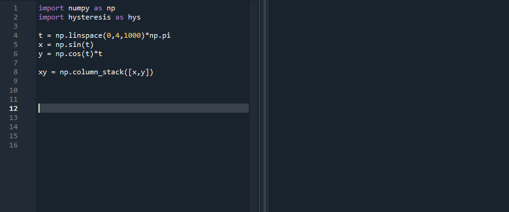

<h1 align = "Left">Hysteresis: Tools for Non-functional curves.</h1>

Hysteresis is a library of tools for non-functional curves, with an emphasis on force-deformation hysteresis curves.
While functions only have one direction, non-functional curves change direction and each x is mapped to more than one y. 
Hysteresis breaks up these curves into a number of functions that can be easily analyzed. Some key features of the library include:

* Finding peaks or reversal points in data.
* Numerically finding the slope or area of a curve.
* Resampling curves.
* Comparing Hysteresis made with simialar load protocols.

A overview of the functions currently availible to users can be found here: https://hysteresis.readthedocs.io/en/latest/

Some selected examples can be found here: https://github.com/cslotboom/hysteresis/tree/master/examples

## Contents

* [Demo](https://github.com/cslotboom/Hysteresis#demo)
* [Install](https://github.com/cslotboom/Hysteresis#install)
* [Features](https://github.com/cslotboom/Hysteresis#features)
* [Tutorials](https://github.com/cslotboom/Hysteresis#tutorials)
* [Terminology/gottca](https://github.com/cslotboom/Hysteresis#Terminology)

## Basic Demo

A basic demo of the hystresis object. 
Hysteresis can split up a non-function into a number of cycles that are functions.
This allows them to be analyzed more easily or compared with other hystereses.

## Install

Hysteresis is pip installable via:

`pip install hysteresis`

## Features

Using Hysteresis, it's possible to:

Find peaks

Find cycles:

Find energy in a hysteresis:

Down sample a hysteresis:

## Terminology

A SimpleCycle is Curve that is a function, that is, each x value is paired with a single y value.
The term "Cycle" is a little nebulus, as it implies that we return to where we started.

A MonotonicCurve is a Curve that only increases or decreases

